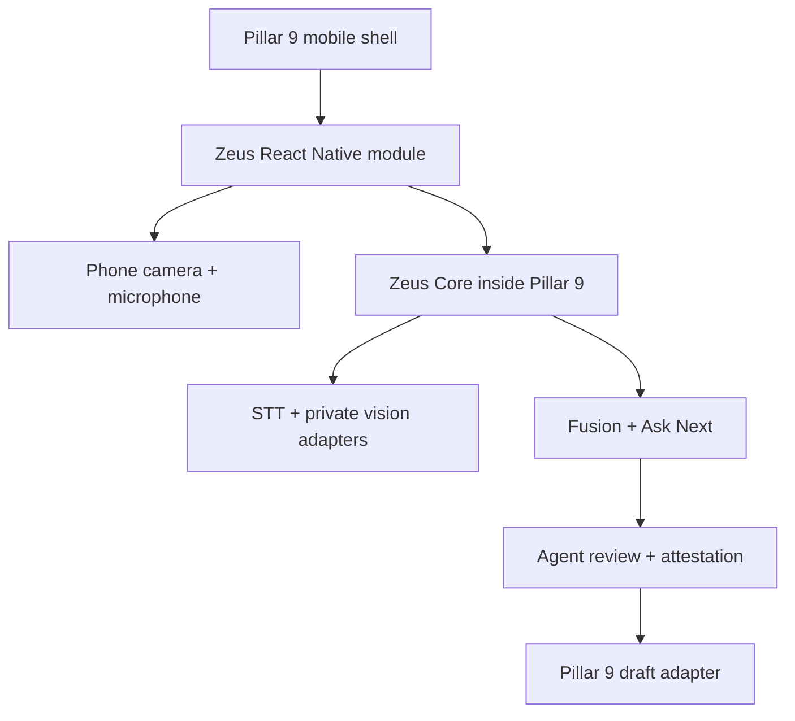

# Zeus phone-first architecture

Zeus is an embeddable Pillar 9 capture module plus a private microservice. It is
not a separate SaaS, billing or public MLS publisher. The realtor deliberately
starts a visible session, reviews derived facts and approves a Pillar 9 draft.

## Mobile responsibilities

| Component | Responsibility | Data leaving phone |
|---|---|---|
| `PhoneCameraSource` | Preview, tap focus, pinch zoom, selected evidence | Throttled detection metadata; selected images only |
| `usePhonePerception` | SSDLite inference on VisionCamera worklet | Labels, scores, normalized boxes, model version |
| `DetectionOverlay` | Cover-crop-aware real-time boxes | None |
| `PhoneAudioSource` | Mono PCM16 microphone chunks | Bounded chunks while active |
| `ZeusClient` | Authenticated REST/WS, reconnect queue | Capture and review events |
| `ZeusVisionCapture` | Start, Live, Extraction, Review, Approval | Decisions and attestation |

The continuous camera stream is never uploaded. Evidence frame upload can be
disabled. Raw audio is held in bounded memory windows and is not saved by Zeus.

## Core event contract

Client events: `audio.chunk`, `detection.batch`, `transcript.segment`,
`room.changed`, `session.pause`, `session.resume`, `session.review`, `ping`.

Server events: `session.snapshot`, `transcript.final`, `draft.updated`,
`submission.completed`, `pong`, `error`.

All device-specific code ends at `CameraSource` and `AudioSource`. A future Omi
bridge emits the same normalized events and does not change Zeus Core.

The reference uses SQLite/in-process WebSockets for a single-replica pilot.
Production scale moves state and fan-out to Pillar 9's approved database and
message bus without changing the mobile contract.
